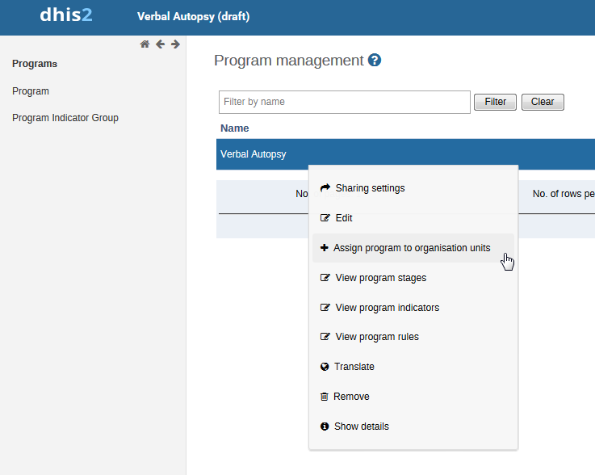

# Installation Guide

This guide shows how to install Verbal Autopsy metadata on an existing DHIS2 instance - JSON files are in `metadata` folder.

- _CoD codes_ **Option Set** (including all options for Cause of Death)
- _Sex_ **Option set** (including 5 options)
- _Algorithm metadata_ **Option set** (containing a reference on how the Cause of Death was obtained)
- 6 **Data Elements**
- 1 **Program**
- 1 **Program Stage**
- 6 **Program Stage Data Elements**
- 1 **User Role**
- 1 **User Group**
- 2 **Event Reports**: 
	- "Top causes of death this year" (aggregate report) 
	- "Verbal Autopsies conducted in the last 12 months" (individual events overview)
- 1 **Dashboard** displaying the 2 mentioned Event Reports

## Preparation

1. Find out the `default` Category Combo UID on the target server by using the following API Query: `/api/categoryCombos?query=default`.
2. Open `va_dataelements.json` with a text editor.
3. "Find and Replace..." the Category Combo UID `bjDvmb4bfuf` with the UID found in step 1 and resave the file.
4. Do the same in `va_program.json` and find and replace the program's `categoryCombo` by replacing `bjDvmb4bfuf` with the UID found in step 1 and resave the file.
5. Find out the root (`level 1`) Organisation Unit UID on the target server by using the following API Query: `/api/organisationUnits?level=1`.
6. Open `va_dashboard.json` with a text editor.
7. "Find and Replace..." the Organisation Unit UID `wEVB21sQaHu` of the 2 Event Reports with the UID found in step 5 and resave the file.

## Import

Import the prepared files in the following sequence now with DHIS2's _Import-Export_ app.
On every file, a _Dry run_ should be done to validate the import first.

1. `va_cod_codes_optionset.json` 
2. `va_sex_optionset.json` (to be verified if this option set is not existing yet in DHIS 2 instance in which module is being installed)
3. `va_algorithm_metadata_optionset.json`
4. `va_dataelements.json`
5. `va_program.json`
6. `va_userrole.json`
7. `va_usergroups.json` 
8. `va_dashboard.json`

## Link Program to Organisation Units

The Organisation Units (e.g. districts) to which verbal autopsies are associated need to be linked to the Program "Verbal Autopsy", by performing the following steps: 
1. access "Programs/Attributes" app
2. access "Program"
3. click on "Verbal Autopsy" program
4. choose option "Assign program to organisation units"

5. select the relevant organisational units

## User Access control & Sharing

### User Groups

#### User Group 1 - _openVA Admin_

This User Group should only contain one user (see below). It is to enforce Edit rights to only the `openva-pipeline` user as well as DHIS2 Superusers.

### User Roles

#### User Role 1 - _openVA Pipeline_
The User Role **openVA Pipeline** is crucial, because the Interface sending Verbal Autopsy events needs to be able to do so, as well as _Edit and View_ rights for Public Option Sets related to Verbal Autopsy - i.e. it **must** be able to edit CoD codes and the Algorithm metadata on how the Cause of Death was obtained.

### User Creation

Create a User for the openVA Pipeline Interface:

1. Give the user the name `openva-pipeline`
2. Assign the User Role **openVA Pipeline**
3. Assign the **Root Organisation Unit** in _Data capture and maintenance organisation units_ to the user
4. Assign the User Group **openVA Admin**

### Sharing

Certain imported metadata has explicitly defined sharing settings (that concern availability of the objects for reading or modification), more concretely:

#### _openVA Pipeline_ User Role
  - Public Access: _None_
  - User Group with Read/Write Access: _None_
  - User Group with Read-Only Access: _None_
  
#### _openVA Admin_ User Group
  - Public Access: _None_
  - User Group with Read/Write Access: _None_
  - User Group with Read-Only Access: _None_

#### _Verbal Autopsy CoD codes_ Option Set (for "VA-05-Most probable Cause of Death" data element)
 - Public Access: **View**
 - User Group with Read/Write Access: **openVA Admin**
 - User Group with Read-Only Access: _None_

#### _Verbal Autopsy Sex_ Option Set (for "VA-02-Sex" data element)
  - Public Access: **View**
  - User Group with Read/Write Access: **openVA Admin**
  - User Group with Read-Only Access: _None_

#### _Verbal Autopsy Algorithm Metadata_ Option Set (for "VA-07-Algorithm metadata on how CoD was obtained" data element)
  - Public Access: **View**
  - User Group with Read/Write Access: **openVA Admin**
  - User Group with Read-Only Access: _None_

In case there is a need for more restrictive access, it would be possible to set all "Public Access" to None while giving Read-Only Access to another User Group called e.g. `openVA User`.
